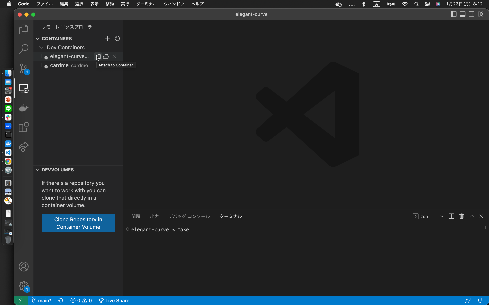

## 簡単な説明でわかる方
こちら私の記事です 一通りやり方書いてます

>https://qiita.com/chihiro-yabuta/items/72e4a1869e9196ca9a67

## 詳細な説明が必要な方（上田研の方
### Step0: csvファイル、ディレクトリを準備しましょう
下記に従って用意して下さい<br>
データの準備の仕方は先輩や先生に聞いて下さい

<pre>
.
├── archive
│   ├── *.csv (実行されないファイルです 直接置いてもいいですが、その場合 .gitignoreを追記する必要があります)
├── csv
│   ├── *.csv (実行されるファイルです)
├── json
│   ├── *.json (jsonファイルがここに出力されます)
</pre>

### Step1: docker をインストールしましょう
ここからdockerをインストールします

>https://docs.docker.com/desktop/mac/apple-silicon/

こちらM1 Macbook Air用なので各々調べて下さい


インストールできたらアプリを立ち上げておきましょう<br>
docker desktop を立ち上げないと docker は動かせません

### Step2: vscode に拡張機能をインストールしましょう
この二つインストールして下さい<br>
vscodeは調べてインストールして下さい


### Step3: clone しましょう
リポジトリをclone (zip downloadでも構いません) しましょう<br>
git は既にmacに入っていると思うのでターミナルを立ち上げて

```
git clone https://github.com/chihiro-yabuta/elegant-curve.git
```

を叩きましょう

### Step4: コンテナを立ち上げましょう
clone したディレクトリを開いて

```
docker compose up -d
```

を叩きましょう


立ち上がったら container に attach しましょう



attach できたら

```
python main.py
```

で走らせましょう


お疲れ様でした
